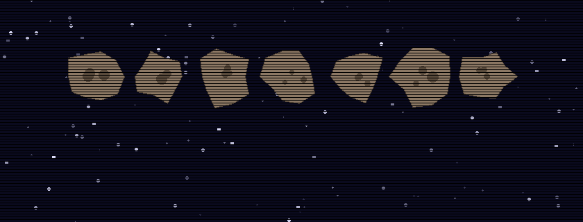

## 👋 About Me

Senior Solution Engineer for **Apps & AI at Microsoft** with 20+ years of experience in cloud architecture, platform engineering, and AI-driven development. I help strategic enterprise customers accelerate their cloud journeys on Azure — from architecture design to hands-on code contributions.

🌍 Based in Munich, Germany &nbsp;|&nbsp; 🇩🇪 German nationality

---

## 🚀 What I Do

- **Account Swarming** — Supporting strategic Azure accounts (Volkswagen, BMW, EON, Mercedes-Benz, DPDHL, Commerzbank, Deutsche Bahn) by mitigating technical blockers with Azure Product Engineering and managing stakeholders
- **Workshops & Training** — Creating and delivering on-site/remote workshops, hackathons, and classroom trainings (Azure, Architecture Reviews, Micro Services, GitHub Copilot, AI Accelerators) to **2,500+ participants per year**
- **Platform Engineering** — Defining strategic long-term platform roadmaps following reference architecture designs, helping teams scale (e.g., €2K → €50K monthly consumption within 6 months)
- **Hands-on Engineering** — Contributing regularly to customer codebases in C#, Java, Terraform, Go, and Python
- **Technical Hiring** — Lead technical interviewer in 20+ hires within our organization

---

## 🛠️ Tech Stack

---

## 💼 Experience

| Period | Role | Company | Location |
|--------|------|---------|----------|
| 2022 – Present | **Senior Solution Engineer — Apps & AI** | Microsoft Germany GmbH | Munich 🇩🇪 |
| 2021 – 2022 | **Team Lead — SAP IT Platform CoE** | SAP SE | Walldorf 🇩🇪 |
| 2015 – 2021 | **Principal Cloud Solution Architect** | SAP SE | Walldorf 🇩🇪 |
| 2013 – 2015 | **Senior Program Architect — IT Enterprise Architecture** | SAP SE | Walldorf 🇩🇪 |
| 2011 – 2013 | **Developer — SAP EMR** | SAP SE | Karlsruhe 🇩🇪 |
| 2005 – 2011 | **Working Student / Intern / Thesis** | SAP SE | Walldorf 🇩🇪 |

📖 <b>Click for detailed role descriptions</b>

### Microsoft Germany GmbH — Senior Solution Engineer (2022 – Present)
- Account swarming for strategic Azure customers; mitigating technical blockers with Azure Product Engineering
- Creating and delivering workshops/hackathons/trainings to 2,500+ participants/year
- Defining strategic platform engineering roadmaps using reference architectures and best practices
- Collaborating with Data & AI CSAs to blueprint application workloads and scalable landing zones
- Contributing to customer codebases (C#, Java, Terraform); lead technical interviewer (20+ hires)
- Conference, university, and dev community speaker

### SAP SE — Team Lead, Platform CoE (2021 – 2022)
- Managing a team of 15 internationally distributed people and third-party services (EPAM, TCS)
- Introduced agile working model (Scrum/SAFe); operated 1,000+ applications on SAP BTP
- Reworked operation processes with automations, decreasing tenant provisioning time by >50%
- Represented team in executive calls; introduced weekly office hours for LoBs and customers

### SAP SE — Principal Cloud Solution Architect (2015 – 2021)
- Founding member and lead architect of the SAP IT Platform CoE (scaled from 7 → 50 colleagues)
- Built a SAP BTP developer platform from scratch for 2,000+ developers and 1,000+ applications
- Part of the SAP IT Lead Architect roundtable for strategic roadmap discussions across all LoBs
- Expert for SAP BTP oAuth2 AuthN/Z; worldwide classroom trainer (Singapore, Vancouver, Israel)
- Advised external customers (Telekom, Bayer, Siemens) on SAP BTP cloud migrations
- Speaker at ASUG, SAP DKOM, University of Applied Sciences Mannheim

### SAP SE — Senior Program Architect (2013 – 2015)
- Technical lead and architectural support for SAP IT projects ("SAP IT goes SAP HANA", SAP Store)

### SAP SE — Developer, SAP EMR (2011 – 2013)
- Building mobile apps (iOS, Android, Windows) for patients and physicians ([SAP EMR](https://www.youtube.com/watch?v=n1eUSxgfcOE))

---

## 🎓 Education

| Degree | Institution | Grade |
|--------|-------------|-------|
| **M.Sc. Computer Science** (2009 – 2011) | University of Applied Sciences Mannheim | 1.3 |
| **B.Sc. Computer Science** (2005 – 2009) | University of Applied Sciences Mannheim | 1.4 |

---

## 🏆 Honors & Awards

- 🏅 **SAP Product Award "Best Design"** (2012) — Received for the SAP EMR application

---

## 📜 Certifications

- ☁️ [**Azure Fundamentals — AZ 900**](https://www.credly.com/badges/42725564-7918-49a9-9047-c1e2160b4923/linked_in_profile) (Microsoft, 2022)
- 🏛️ [**SAP Architecture Curriculum**](https://ieeexplore.ieee.org/document/5457772) (SAP SE)

---

## 📝 Publications & Projects

| Year | Title | Link |
|------|-------|------|
| 2025 | **The Azure AI Agent Workshop** — Lab for automotive customers, training hundreds of developers in AI agent development | [🔗 Workshop](https://ailabs.jeff-tech.de/) |
| 2024 | **GitHub Copilot Customer Workshop** — Utilized by thousands of developers across training sessions worldwide | [🔗 Repository](https://azure-samples.github.io/github-copilot-hands-on/) |
| 2022 | **Distributed Data & Cross Database Access in Hybrid Cloud Landscapes** — SAP HANA Cloud and SDA | [🔗 Article](https://blogs.sap.com/2022/06/13/distributed-data-and-cross-database-access-in-hybrid-cloud-landscapes-with-sap-hana-cloud-and-sda/) |
| 2021 | **SAP XSUAA Golang Client Library** — Alternative Golang client for AuthZ/N in SAP BTP | [🔗 GitHub](https://github.com/SAP-archive/cloud-security-client-golang-xsuaa) |
| 2020 | **Demystifying XSUAA in SAP Cloud Foundry** — 100,000+ views on SAP Community | [🔗 Article](https://blogs.sap.com/2020/08/20/demystifying-xsuaa-in-sap-cloud-foundry/) |

---

## 📊 GitHub Stats

---

<i>💬 Let's connect — I'm always happy to chat about cloud architecture, AI, or platform engineering!</i>

